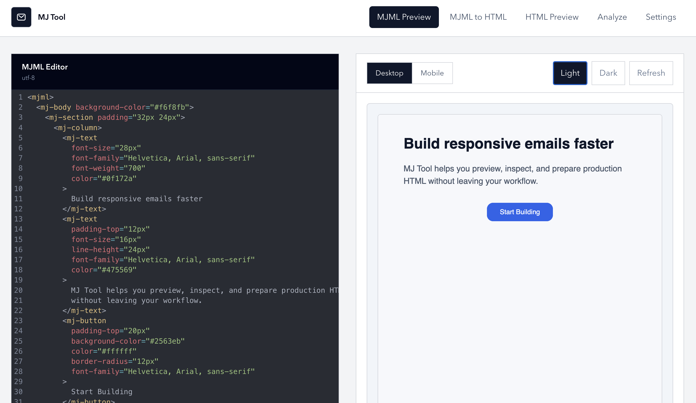
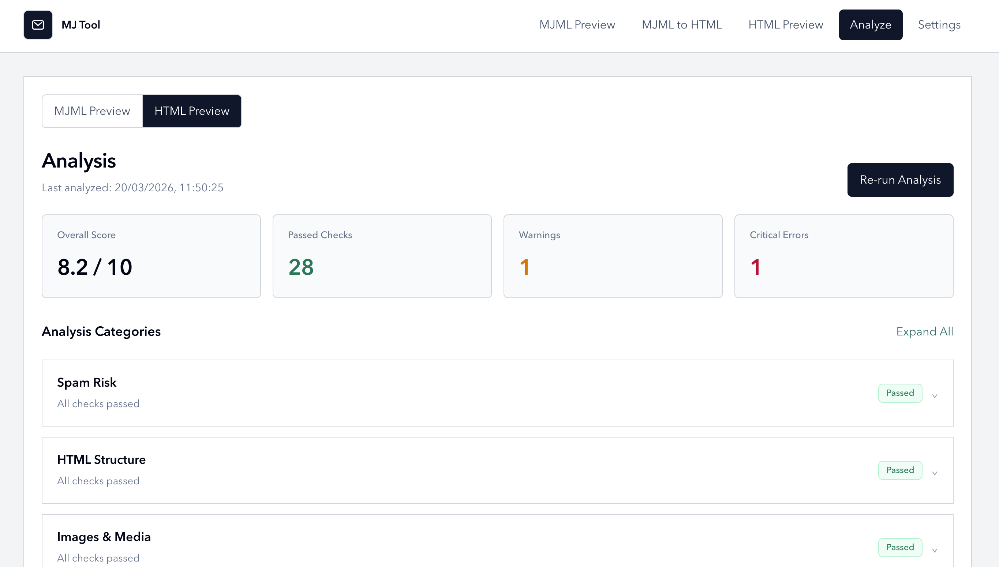

# MJ Tool


`MJ Tool` is a local web app for building and reviewing MJML email templates in one place. Write MJML, convert it to HTML, preview the output, inspect generated markup, and run rule-based checks without bouncing between separate tools.

## Screenshots

| Editor / Preview | Analyze |
| --- | --- |
|  |  |

## Features

- Edit MJML in a dedicated code editor
- Convert MJML templates into production-ready HTML
- Preview rendered output and inspect generated markup
- Analyze generated or pasted HTML with built-in checks
- Save preview defaults and analyzer preferences locally

## Stack

- Next.js
- React
- TypeScript
- MJML
- Tailwind CSS
- Cheerio
- html-minifier-terser
- CodeMirror

## Commands

```bash
npm install
npm run dev
npm run build
npm start
npm run lint
```

## Getting Started

1. Install dependencies:

```bash
npm install
```

2. Start the development server:

```bash
npm run dev
```

3. Open the app in your browser:

```text
http://localhost:3000
```

## License

This project is licensed under the MIT License. See the [LICENSE](./LICENSE) file for details.
