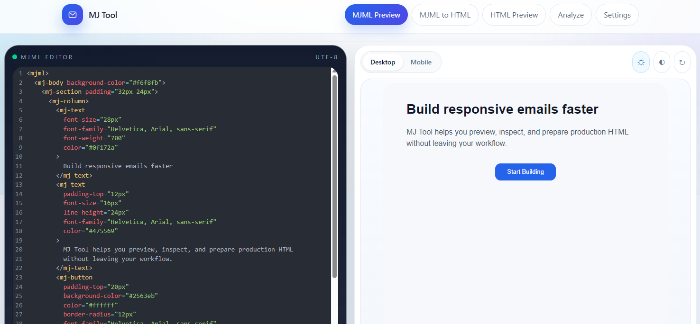

# MJ Tool

MJ Tool is a local web app for building and reviewing MJML email templates. It gives you a place to edit MJML, convert it to HTML, preview the result, inspect the generated markup, run rule-based analysis.


## What It Does

- Edit MJML with a code editor and refresh the preview on demand
- Convert MJML to HTML
- Inspect, copy, download, minify, and open generated HTML in a new tab
- Preview raw HTML separately from the MJML workflow
- Run analysis against generated or pasted HTML through
- Save preview defaults and analyzer preferences in local storage

## Screenshots

Add 1 to 3 screenshots here once you have them ready:

```md

```

## Tech Stack

- Next.js App Router
- React 19
- TypeScript
- Tailwind CSS
- MJML
- html-minifier-terser
- Cheerio
- CodeMirror

## Getting Started

1. Install dependencies:

```bash
npm install
```

2. Start the development server:

```bash
npm run dev
```

3. Open the app:

```text
http://localhost:3000
```

The project intentionally uses webpack for `dev` and `build` because MJML is more stable there than in Turbopack for this app.

